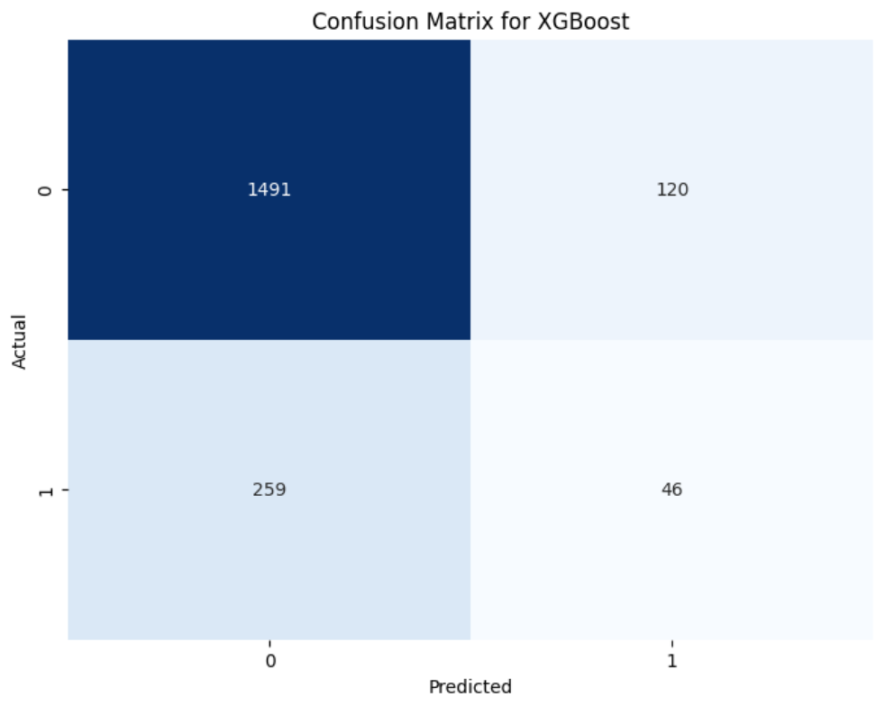
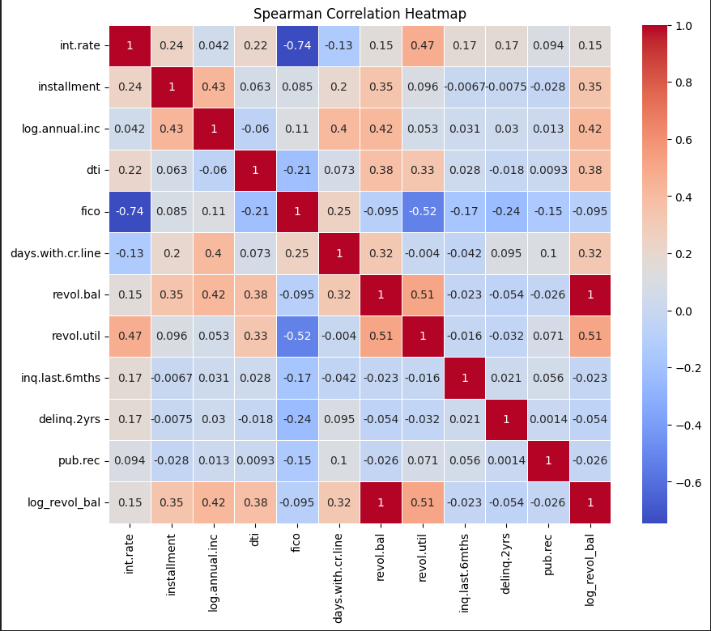
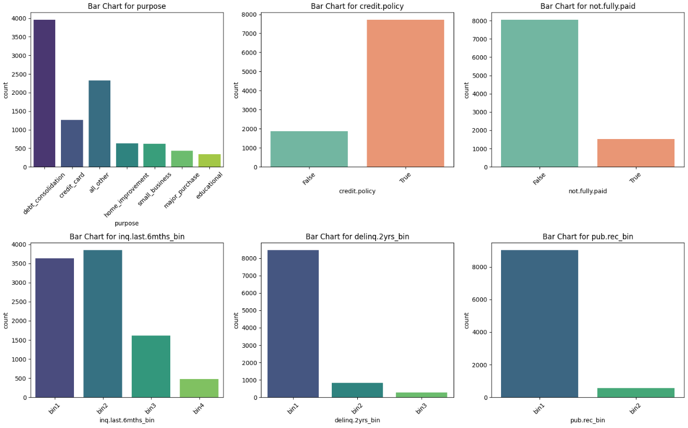
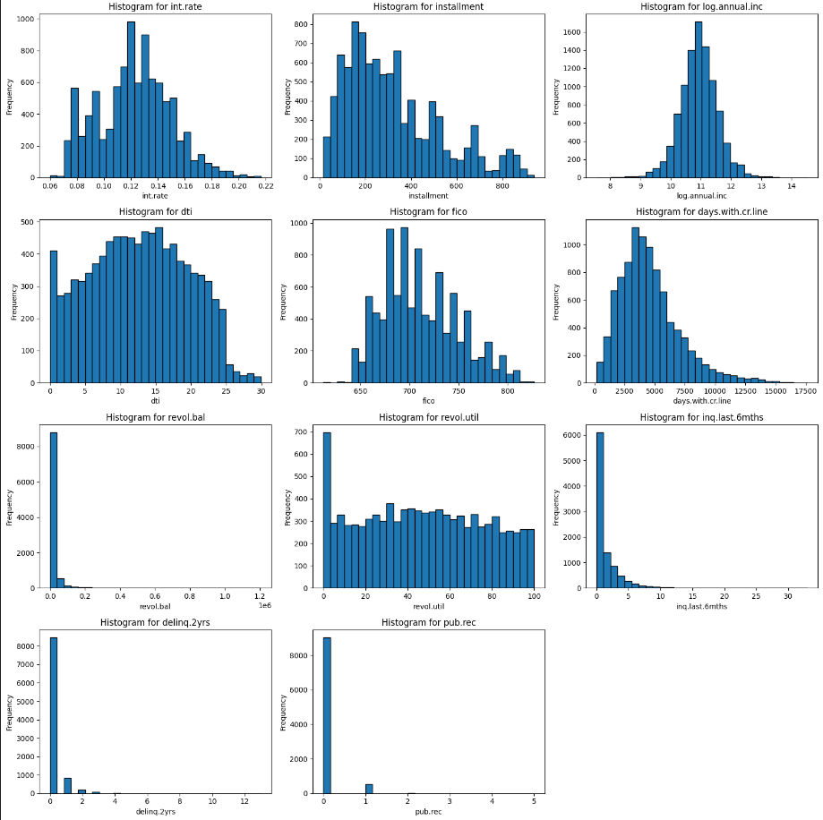

---

## 📌 Overview
A machine learning model to **predict loan credit approval** based on applicant features.

---

## 🚀 Features
- 📊 Comprehensive exploratory data analysis  
- 🤖 Multiple ML models implementation  
- 💯 High accuracy prediction  
- 🧪 Train and test the model on new datasets  

---

## 🧩 Project Screenshots









---

## 🛠 Project Structure

Loan-Credit-Predict/

├── images/

├── loan.csv/

├── main.py # Main prediction script

├── requirements.txt # Required libraries

└── README.md # This file

---

## ▶️ How to Run

1. Clone the repo:
   ```bash
   git clone https://github.com/amirhosssein0/Loan-Credit-Predict.git
   cd Loan-Credit-Predict

2. Install dependencies:
  ```bash
  pip install -r requirements.txt
  ```

3. Run the prediction:
  ```bash
  python main.py
  ```

🧠 How it Works

The main.py script processes new input data, applies preprocessing, then uses the trained model to predict loan approval status. The output is displayed or saved to a file.
🤝 Contributing

    ⭐ Star the repo

    📝 Open issues

    🔀 Submit pull requests
    All contributions and feedback are welcome!

📝 License

This project is licensed under the MIT License.
💬 Contact

Feel free to reach out via issues or pull requests if you have questions or suggestions!
